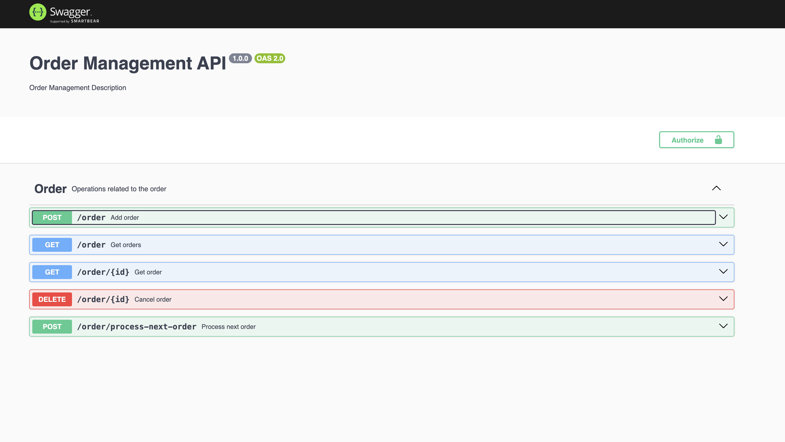

# Order Management API

From the Backend directory, you can run:

### `npm install`
### `npm run dev`

Open [http://localhost:3002](http://localhost:3002) to view it in the browser.

## API Documentation

Swagger URL - [http://localhost:3002/api-docs](http://localhost:3002/api-docs)

